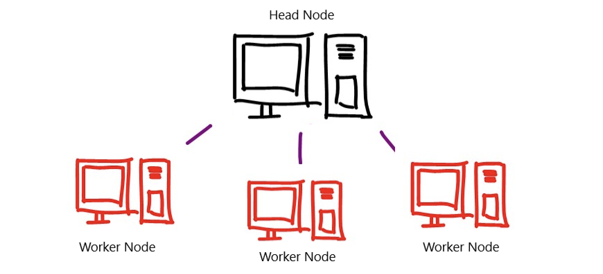

# Agentic Automation: The Future of Workflows
### GPT-4o+Ray+Prefect: Unlocking Efficiency, Intelligence, and Resiliency


__Image credit to [What are Agentic Workflows? ](https://giancarlomori.substack.com/p/what-are-agentic-workflows)__

**Introduction**

In today's fast-paced world, businesses are constantly seeking ways to streamline operations and increase efficiency. Agentic workflow automation, a paradigm that empowers agents to execute tasks autonomously, offers a promising solution. By combining the distributed computing framework Ray with the workflow orchestration platform PREFECT, we can create powerful and scalable systems that automate complex workflows.

This powerful combination offers several key advantages:

* **Structured Data Integration:** Structured outputs ensure that data is formatted in a way that is easily understandable and usable by downstream systems.
* **Scalability and Efficiency:** Ray's distributed computing framework enables the efficient execution of tasks across multiple machines, handling large datasets and complex workflows with ease.
* **Workflow Management and Orchestration:** Prefect provides a robust platform for defining, scheduling, and monitoring workflows, ensuring reliability and maintainability.

**Key Points:**

* The code showcases how Ray is used to run the CustomAgent in a distributed manner.
* Prefect handles task scheduling, execution, and logging, ensuring workflow reliability.

## Distributed Computing Power: A Catalyst for Innovation

Distributed computing systems, like those powered by Ray, are poised to revolutionize a wide range of industries and solve some of the world's most pressing challenges. By harnessing the power of distributed computing, we can unlock new possibilities in scientific research, artificial intelligence, financial services, the Internet of Things, and beyond.

### **What Are Agents in Workflow Automation?**

In the context of workflow automation, agents are autonomous programs or entities designed to perform specific tasks. They act based on predefined rules, data inputs, or external stimuli, making decisions and carrying out actions without continuous human intervention. Each agent is responsible for completing a distinct part of the workflow, and these agents can either work independently or collaboratively to accomplish broader goals.

Agents in workflow automation typically:
- **Monitor** for events or triggers in the system.
- **Process** the data they receive and determine the necessary action.
- **Execute** actions, whether that be updating a database, sending notifications, or initiating further tasks in the pipeline.

The beauty of agentic automation lies in the system's ability to adapt and evolve, as agents can be added, reconfigured, or enhanced based on changing needs.

### **Agentic Workflow Automation in Practice**

Real-world applications of agentic workflow automation span across industries:
- **Customer Support Systems**: Automating ticket categorization, escalation, and resolution based on customer inputs and historical data.
- **DevOps Pipelines**: Agents handling code integration, testing, and deployment without manual oversight.
- **Financial Transactions**: Automated agents monitoring transactions, flagging anomalies, and processing payments in real-time.

These systems reduce human workload, improve speed, and increase overall accuracy, making agentic workflow automation a powerful tool in modern organizations.

**The Power of Structured Output**

Structured output is a technique that involves producing outputs in a predefined format, such as JSON or XML. This can be particularly useful in agentic workflow automation, as it allows agents to easily communicate and exchange data.

By combining LLMs, agentic workflow automation, and structured output, we can create powerful and flexible systems that can automate a wide range of tasks. 

In the provided code, the `CustomAgent` class utilizes an LLM to determine the appropriate workflow to execute based on the user input. The LLM is used to analyze the input and identify the relevant process and input parameters.

In the context of agentic workflow automation, Large Language Models (LLMs) play a pivotal role in:

* **Understanding Natural Language:** LLMs can process and interpret human language, enabling agents to understand and respond to user requests and instructions.
* **Task Selection and Routing:** Based on the user's input, LLMs can determine the most appropriate workflow or task to execute.
* **Dynamic Workflow Generation:** LLMs can generate new workflows on-the-fly, adapting to changing circumstances or requirements.
* **Knowledge Base Access:** LLMs can access and process information from external knowledge bases, providing agents with relevant data to complete their tasks.

**The Role of Ray**



## **Why Ray is a Game-Changer for Complex Multi-Agent Workflow Automation**

When dealing with complex, multi-agent workflows, traditional approaches often fall short in terms of scalability, performance, and flexibility. Here's where Ray, a distributed framework, shines.

### **1. Scalability and Performance:**
* **Dynamic Resource Allocation:** Ray's dynamic resource allocation allows you to efficiently utilize available resources, ensuring that your workflow can scale to handle increasing workloads.
* **Parallel Execution:** Ray enables parallel execution of tasks, significantly speeding up your workflows. This is especially beneficial for computationally intensive tasks or when dealing with large datasets.
* **Distributed Computing:** Ray's distributed computing capabilities allow you to distribute your workflow across multiple machines, enhancing performance and fault tolerance.

### **2. Flexibility and Customization:**
* **Task Graphs:** Ray's task graph abstraction provides a flexible way to define and execute complex workflows, allowing you to easily customize and modify your automation.
* **Actors:** Actors in Ray are independent units of computation that can communicate and coordinate with each other, making them ideal for building distributed systems and agents.
* **Integration with Other Tools:** Ray integrates seamlessly with popular libraries and frameworks, such as TensorFlow, PyTorch, and Horovod, allowing you to leverage their capabilities within your workflows.

### **3. Fault Tolerance and Reliability:**
* **Automatic Restart:** If a task or actor fails, Ray can automatically restart it on a different machine, ensuring that your workflow continues to run without interruption.
* **Checkpoint and Recovery:** Ray supports checkpointing, allowing you to save the state of your workflow at regular intervals. In case of a failure, you can recover from the last checkpoint, minimizing downtime.

### **4. Simplified Development and Management:**
* **High-Level API:** Ray's high-level API simplifies the development of distributed applications, making it easier to build and manage your workflows.
* **Unified Interface:** Ray provides a unified interface for both local and distributed execution, allowing you to develop and test your workflows on a single machine before scaling them out.

### **Real-World Use Cases:**
* **Machine Learning Pipelines:** Ray can be used to build and manage complex machine learning pipelines, from data preprocessing to model training and evaluation.
* **Simulation and Robotics:** Ray can be used to simulate and control large-scale robotic systems, enabling researchers to test and optimize their designs.
* **Web Applications:** Ray can be used to scale web applications by distributing tasks across multiple machines, improving performance and reliability.

### Core Features

* **Task Parallelism:** Easily parallelize tasks and distribute them across multiple machines for faster execution.
* **Actor Model:** Create stateful actors that can handle multiple tasks concurrently and maintain their own state.
* **Remote Procedure Calls (RPCs):** Call functions on remote machines seamlessly, enabling distributed applications.
* **Task Scheduling:** Automatically schedule tasks for efficient execution across available resources.
* **Fault Tolerance:** Handle failures gracefully and recover from errors to ensure application reliability.

**In conclusion,** Ray offers a powerful and flexible solution for building and managing complex multi-agent workflow automations. Its scalability, performance, flexibility, fault tolerance, and simplified development make it an ideal choice for a wide range of applications.

**The Power of PREFECT**


### Core Features

* **Workflow Orchestration:** Easily define and manage complex workflows composed of multiple tasks, dependencies, and schedules.
* **Task Definition:** Create reusable, modular tasks that can be combined and executed within workflows.
* **Scheduling:** Schedule workflows to run on a regular basis or based on specific triggers.
* **Retries and Timeouts:** Implement retry logic and timeouts to handle failures and ensure workflow reliability.
* **Parallelism:** Execute tasks concurrently to improve performance and reduce processing time.

**Combining Ray and PREFECT for Maximum Impact**

By combining Ray and PREFECT, we can create powerful and scalable agentic workflow automation systems. Ray handles the underlying distribution and execution of tasks, while PREFECT provides the necessary orchestration and management capabilities. This combination offers several benefits, including:

* **Simplified development:** PREFECT's high-level interface makes it easy to define and manage complex workflows.
* **Improved performance:** Ray's distributed computing capabilities ensure that workflows are executed efficiently.
* **Enhanced reliability:** PREFECT's fault tolerance mechanisms and Ray's automatic recovery capabilities help to ensure that workflows are resilient to failures.

### Limitations and Challenges of Agentic Workflow Automation

Agentic workflow automation, while offering significant benefits, is not without its limitations and challenges. Here are some key considerations:

**1. Complexity:**
* **Large-Scale Workflows:** Designing and managing complex workflows with numerous agents and interactions can be challenging, requiring careful planning and coordination.
* **Unforeseen Scenarios:** Handling unexpected situations or deviations from the planned workflow can be difficult, as agents may not be equipped to deal with unforeseen circumstances.

**2. Data Quality and Consistency:**
* **Data Integrity:** Ensuring data quality and consistency across multiple agents and systems can be a challenge, especially when dealing with large datasets and complex workflows.
* **Data Privacy:** Protecting sensitive data and ensuring compliance with privacy regulations is crucial, but it can be difficult to maintain data security in distributed systems.

**3. Agent Development and Maintenance:**
* **Agent Creation:** Developing agents with the necessary capabilities and intelligence can be time-consuming and resource-intensive.
* **Agent Maintenance:** Agents may require ongoing maintenance and updates to keep them up-to-date with changes in the environment or requirements.

**4. Scalability and Performance:**
* **Resource Constraints:** Scaling agentic workflow automation systems to handle large workloads or complex tasks can be challenging, especially when dealing with limited computational resources.
* **Performance Bottlenecks:** Identifying and addressing performance bottlenecks in distributed systems can be difficult, as it may involve multiple components and interactions.

**5. Interoperability:**
* **Integration Challenges:** Integrating agentic workflow automation systems with existing IT infrastructure and applications can be complex, requiring careful planning and consideration of compatibility issues.
* **Standards and Protocols:** The lack of standardized protocols and frameworks for agentic workflow automation can hinder interoperability and make it difficult to integrate different systems.

**6. Human Oversight and Control:**
* **Dependency on Humans:** While agents can automate many tasks, they may still require human oversight and intervention to handle complex situations or make critical decisions.
* **Loss of Control:** Over-reliance on agents can lead to a loss of control and visibility into the workflow, making it difficult to identify and address problems.

**7. Ethical Considerations:**
* **Bias and Discrimination:** Agents may inadvertently perpetuate biases or discrimination present in the data they are trained on, leading to unfair or discriminatory outcomes.
* **Accountability:** Determining accountability for actions taken by agents can be challenging, especially in cases of errors or negative consequences.

By understanding these limitations and challenges, organizations can develop strategies to mitigate risks and ensure the successful implementation of agentic workflow automation systems.


## **Security Considerations in Agentic Workflow Automation**

When implementing agentic workflow automation, security is a paramount concern. Here are some key considerations and best practices:

### **1. Data Privacy and Protection:**

* **Data Encryption:** Ensure that sensitive data is encrypted both at rest and in transit. Use strong encryption algorithms and protocols to protect data from unauthorized access.
* **Access Controls:** Implement robust access controls to restrict access to sensitive data and systems to authorized personnel. Use role-based access control (RBAC) to assign appropriate permissions based on job functions.
* **Data Minimization:** Collect and store only the necessary data to minimize the risk of data breaches. Regularly review and delete outdated or unnecessary data.

### **2. LLM Security:**

* **Prompt Engineering:** Carefully craft prompts to avoid unintended biases or harmful outputs from the LLM. Use techniques like prompt engineering and red teaming to identify and mitigate potential risks.
* **Model Selection:** Choose LLMs from reputable providers with strong security measures in place. Consider factors like model size, training data, and the provider's security certifications.
* **Data Privacy:** Ensure that the LLM provider has appropriate data privacy policies and practices in place to protect your data.

### **3. Workflow Security:**

* **Input Validation:** Validate user input to prevent malicious code injection or other attacks.
* **Error Handling:** Implement robust error handling to prevent unexpected behavior or vulnerabilities.
* **Regular Updates:** Keep your workflow automation tools and libraries up-to-date with the latest security patches and updates.
* **Monitoring and Logging:** Monitor your workflows for suspicious activity and log events to facilitate incident response.

### **4. Infrastructure Security:**

* **Network Security:** Protect your network infrastructure with firewalls, intrusion detection systems (IDS), and intrusion prevention systems (IPS).
* **Patch Management:** Keep your operating systems, applications, and infrastructure components up-to-date with the latest security patches.
* **Backup and Recovery:** Implement regular backups of your data and workflows to enable quick recovery in case of a security incident.

### **5. Threat Modeling:**

* **Identify Threats:** Conduct a threat modeling exercise to identify potential threats and vulnerabilities in your workflow automation system.
* **Assess Risks:** Evaluate the likelihood and impact of each identified threat.
* **Implement Controls:** Develop and implement appropriate security controls to mitigate the risks.

By following these security best practices, you can significantly reduce the risk of security breaches and protect your agentic workflow automation systems.

## OUTPUT

```
input:  Give me the stars and contributors for ranfysvalle02/ai-self-attention
06:16:58.732 | INFO    | prefect - Starting temporary server on http://127.0.0.1:8175
See https://docs.prefect.io/3.0/manage/self-host#self-host-a-prefect-server for more information on running a dedicated Prefect server.
06:17:01.407 | INFO    | prefect.engine - Created flow run 'camouflaged-labrador' for flow 'log-repo-info'
06:17:01.528 | INFO    | prefect.task_runner.ray - Creating a local Ray instance
2024-10-13 06:17:02,303	INFO worker.py:1777 -- Started a local Ray instance. View the dashboard at 127.0.0.1:8265 
06:17:02.826 | INFO    | prefect.task_runner.ray - Using Ray cluster with 1 nodes.
06:17:02.827 | INFO    | prefect.task_runner.ray - The Ray UI is available at 127.0.0.1:8265
06:17:03.096 | INFO    | Task run 'get_repo_info-762' - Finished in state Completed()
06:17:03.101 | INFO    | Flow run 'camouflaged-labrador' - Stars 🌠 : 3
06:17:03.277 | INFO    | Task run 'get_contributors-9d8' - Finished in state Completed()
06:17:03.278 | INFO    | Flow run 'camouflaged-labrador' - Number of contributors 👷: 1
06:17:04.824 | INFO    | Flow run 'camouflaged-labrador' - Finished in state Completed()
{'stargazers_count': 3, 'contributors_count': 1}
input:  Make the letter `x` uppercase
06:17:07.057 | INFO    | Task run 'txt_processing' - Finished in state Completed()
X
06:17:07.091 | INFO    | prefect - Stopping temporary server on http://127.0.0.1:8175
```

**[Based on The Prefect Agent](https://github.com/ranfysvalle02/the-prefect-agent/)**

**[Powered by the Prefect-Ray Integration](https://github.com/PrefectHQ/prefect-ray)**

**Understanding the Code:**

The provided code demonstrates a basic agentic workflow automation example using Ray and Prefect. It consists of several key components:

1. **CustomAgent Class:**
   - This class defines an agent that utilizes an LLM (Azure OpenAI in this case) to determine the appropriate workflow to execute based on the user input.
   - The agent uses the LLM to analyze the input and identify the relevant process and input parameters.

2. **Prefect Tasks:**
   - `txt_processing`: This task uses a Tool class to process text input (uppercase conversion in this example).
   - `get_repo_info` and `get_contributors`: These tasks retrieve information from a GitHub repository using HTTP requests.

3. **Prefect Flow:**
   - `log_repo_info`: This flow orchestrates the execution of the tasks, retrieving and displaying information about a GitHub repository.

**How it Works:**

1. **User Input:** The user provides an input to the `CustomAgent`.
2. **LLM Analysis:** The agent uses the LLM to analyze the input and determine the appropriate workflow to execute.
3. **Workflow Execution:** The agent triggers the corresponding Prefect flow based on the LLM's decision.
4. **Task Execution:** The flow executes the necessary tasks, such as retrieving repository information or processing text.
5. **Output:** The flow returns the results of the executed tasks.

**Key Points:**

* The `CustomAgent` leverages the LLM to provide an intelligent decision-making capability.
* Prefect handles the workflow orchestration and task execution.
* Ray is used for distributed computing, enabling efficient execution of tasks.
* The code demonstrates how to define tasks, workflows, and integrate LLMs into agentic workflow automation.

## **Expanding the Agentic Workflow Automation Example**

### **Scenario: Automated Customer Support Ticket Routing and Resolution**

Imagine a customer support system where incoming tickets are automatically routed to the most appropriate agent based on their content and historical data. The system can also leverage natural language processing to extract key information from the ticket and provide initial responses or resolutions.

### **Workflow and Agent Definitions**

1. **Ingestion Agent:**
   - Continuously monitors an incoming queue for new tickets.
   - Extracts key information from the ticket using natural language processing.
   - Determines the appropriate agent or team based on the extracted information and historical data.

2. **Assignment Agent:**
   - Assigns tickets to available agents based on their workload and expertise.
   - Updates the ticket status and assigns a due date.

3. **Resolution Agent:**
   - Utilizes an LLM to generate potential responses or solutions based on the ticket content and historical data.
   - Presents the options to the assigned agent for review and approval.
   - Updates the ticket status and provides a resolution if appropriate.

### **Workflow Orchestration with Prefect**

```python
from prefect import flow, task
from prefect_ray import RayTaskRunner

@task
def ingest_ticket(ticket_id):
    # ... (code to retrieve ticket from queue and extract information)

@task
def assign_agent(ticket_info):
    # ... (code to determine appropriate agent and assign ticket)

@task
def resolve_ticket(ticket_info):
    # ... (code to use LLM to generate responses and update ticket status)

@flow(task_runner=RayTaskRunner)
def customer_support_workflow(ticket_id):
    ticket_info = ingest_ticket(ticket_id)
    agent = assign_agent(ticket_info)
    resolve_ticket(ticket_info, agent)
```
**Additional Considerations**

* **Agent Persistence:** Agents can maintain state and context for handling ongoing conversations or complex tickets.
* **Human-in-the-Loop:** Agents can still be involved in decision-making and oversight, especially for critical or complex cases.
* **Integration with Existing Systems:** The workflow can be integrated with existing customer relationship management (CRM) systems and other tools.

By expanding the example to this more complex scenario, we can see how agentic workflow automation can be applied to real-world problems, providing significant benefits in terms of efficiency, scalability, and intelligent decision-making.

**Conclusion**

 As technology continues to advance, we can expect to see even more innovative and impactful uses of distributed computing power. Agentic workflow automation, powered by Ray and PREFECT, offers a powerful solution for businesses looking to streamline operations and increase efficiency. By leveraging the benefits of distributed computing and workflow orchestration, we can create scalable, flexible, and reliable systems that automate complex tasks. As technology continues to evolve, we can expect to see even more innovative applications of agentic workflow automation in the years to come.

## FULL CODE
The code demonstrates how agentic workflow automation with Ray and Prefect can be implemented. Here's a breakdown of the key components:

* **CustomAgent:** This class defines an agent that utilizes an LLM (Azure OpenAI in this case) to determine the appropriate workflow to execute based on the user input.
* **txt_processing:** This is another Prefect task that uses a Tool class to process text input (uppercase conversion in this example).
* **get_repo_info, get_contributors:** These are Prefect tasks that retrieve information from a GitHub repository.
* **log_repo_info:** This is a Prefect flow that utilizes the previously mentioned tasks to retrieve and display information about a GitHub repository.

```python
import json
import httpx   # an HTTP client library and dependency of Prefect
from prefect import flow, task
from prefect_ray import RayTaskRunner
from openai import AzureOpenAI

AZURE_OPENAI_ENDPOINT = "https://.openai.azure.com"
AZURE_OPENAI_API_KEY = "" 

class Tool:
    def __init__(self, name, description, operation):
        self.name = name
        self.description = description
        self.operation = operation
        self.usage_count = 0

    def run(self, input):
        self.usage_count += 1
        return self.operation(input)

@task
def txt_processing(text: str):
    """Process text"""
    # A task can have tools
    tool1 = Tool("UPPER", "Converts text to uppercase", lambda text: text.upper())
    tool2 = Tool("LOWER", "Converts text to lowercase", lambda text: text.lower())
    ai_message = AzureOpenAI(azure_endpoint=AZURE_OPENAI_ENDPOINT,api_version="2023-07-01-preview",api_key=AZURE_OPENAI_API_KEY).chat.completions.create(
            model="gpt-4o", response_format={ "type": "json_object" },
            messages=[
                {"role": "user", "content": """
        [available tools]
        - Tool("UPPER", "Converts text to uppercase", lambda text: text.upper())
        - Tool("LOWER", "Converts text to lowercase", lambda text: text.lower())
    
        Find the right `TOOL` to solve `INPUT` based on the provided context.
        If no `TOOL` is applicable given the `INPUT`, RETURN AN EMPTY STRING ("").
        [response criteria]
        - JSON Object with the following keys:
            - TOOL: str
            - INPUT_TO_TOOL: object
        - EXAMPLE:
            {
                "TOOL": "UPPER",
                "INPUT_TO_TOOL": {
                    "text": "abc123",
                }
            }
    """+"\nINPUT: "+text+"\n GO!"}])
    ai_message = json.loads(ai_message.choices[0].message.content)
    if ai_message["TOOL"] == "UPPER":
        return tool1.run(ai_message["INPUT_TO_TOOL"]["text"])
    elif ai_message["TOOL"] == "LOWER":
        return tool2.run(ai_message["INPUT_TO_TOOL"]["text"])
    else:
        return "NO_TOOL"
@task(retries=2)
def get_repo_info(repo_owner: str, repo_name: str):
    """Get info about a repo - will retry twice after failing"""
    url = f"https://api.github.com/repos/{repo_owner}/{repo_name}"
    api_response = httpx.get(url)
    api_response.raise_for_status()
    repo_info = api_response.json()
    return repo_info

@task
def get_contributors(repo_info: dict):
    """Get contributors for a repo"""
    contributors_url = repo_info["contributors_url"]
    response = httpx.get(contributors_url)
    response.raise_for_status()
    contributors = response.json()
    return contributors

@flow(log_prints=True, task_runner=RayTaskRunner)
def log_repo_info(repo_owner: str = "ranfysvalle02", repo_name: str = "ai-self-attention"):
    """
    Given a GitHub repository, logs the number of stargazers
    and contributors for that repo.
    """
    repo_info = get_repo_info(repo_owner, repo_name)
    print(f"Stars 🌠 : {repo_info['stargazers_count']}")

    contributors = get_contributors(repo_info)
    print(f"Number of contributors 👷: {len(contributors)}")
    return {
        "stargazers_count": repo_info["stargazers_count"],
        "contributors_count": len(contributors),
    }

class CustomAgent:
    def __init__(self):
        self.objective = """
        Find the right `PROCESS` to solve `INPUT` based on the provided context.
        If no `PROCESS` is applicable given the `INPUT`, RETURN AN EMPTY STRING ("").
        [response criteria]
        - JSON Object with the following keys:
            - PROCESS: str
            - INPUT_TO_PROCESS: object
        - EXAMPLE:
            {
                "PROCESS": "log_repo_info",
                "INPUT_TO_PROCESS": {
                    "repo_owner": "PrefectHQ",
                    "repo_name": "prefect"
                }
            }
        """
        self.process_map = {
            "log_repo_info": """
                Given a GitHub repository, logs the number of stargazers
                and contributors for that repo.
                [input object]
                repo_owner: str
                repo_name: str
                """,
            "text_processing": """
                Given a text input, process it and return the processed text.
                [input object]
                text: str
                """
        }
        self.llm = AzureOpenAI(azure_endpoint=AZURE_OPENAI_ENDPOINT,api_version="2023-07-01-preview",api_key=AZURE_OPENAI_API_KEY)
        self.llm_model = "gpt-4o"
    def run(self, input):
        print("input: ", input)
        # Lets build a string that represents the process map
        process_map_str = ""
        for process_name, process_description in self.process_map.items():
            process_map_str += f"Process: {process_name}\nDescription: {process_description}\n\n"
        # Now lets build a string that represents the input
        input_str = f"Input: {input}\n\n"
        # Now lets build a string that represents the objective
        objective_str = f"Objective: {self.objective}\n\n"
        # Finally, lets build the prompt
        prompt = process_map_str + input_str + objective_str
        ai_message = self.llm.chat.completions.create(
            model=self.llm_model, response_format={ "type": "json_object" },
            messages=[
                {"role": "user", "content": prompt}
            ])
        ai_message = json.loads(ai_message.choices[0].message.content)
        if ai_message.get("PROCESS") and ai_message.get("PROCESS") == "log_repo_info":
            input_to_process = ai_message["INPUT_TO_PROCESS"]
            repo_info = log_repo_info(**input_to_process)
            return repo_info
        if ai_message.get("PROCESS") and ai_message.get("PROCESS") == "text_processing":
            input_to_process = ai_message["INPUT_TO_PROCESS"]
            txt_result = txt_processing(**input_to_process)
            return txt_result
        else:
            print("No process found for input: ", input)
            ai_message = self.llm.chat.completions.create(
                model=self.llm_model,
                messages=[
                {"role": "user", "content": input}
            ])
            print("AI response: ", ai_message.choices[0].message.content)
            return ai_message.choices[0].message.content

if __name__ == "__main__":
    agent = CustomAgent()
    run1 = agent.run("Give me the stars and contributors for ranfysvalle02/ai-self-attention")
    print(run1)
    run2 = agent.run("Make the letter `x` uppercase")
    print(run2)
        
```
