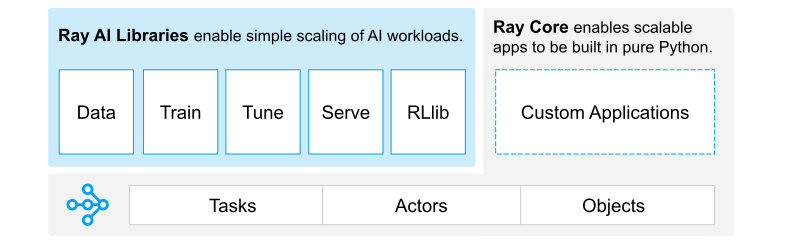

## Agentic Workflow Automation with RAY and PREFECT

**Introduction**

In today's fast-paced world, businesses are constantly seeking ways to streamline operations and increase efficiency. Agentic workflow automation, a paradigm that empowers agents to execute tasks autonomously, offers a promising solution. By combining the distributed computing framework RAY with the workflow orchestration platform PREFECT, we can create powerful and scalable systems that automate complex workflows.

**The Power of Structured Output**

Structured output is a technique that involves producing outputs in a predefined format, such as JSON or XML. This can be particularly useful in agentic workflow automation, as it allows agents to easily communicate and exchange data.

Combining LLMs, Agentic Workflow Automation, and Structured Output

By combining LLMs, agentic workflow automation, and structured output, we can create powerful and flexible systems that can automate a wide range of tasks. 

**Understanding Agentic Workflow Automation**

Agentic workflow automation is a paradigm where agents, autonomous entities within a system, are responsible for executing tasks independently. This approach offers several advantages, including:

* **Scalability:** Agents can be dynamically scaled up or down based on workload, ensuring optimal resource utilization.
* **Flexibility:** Agents can be easily adapted to changing requirements and new tasks.
* **Resilience:** If an agent fails, the workflow can continue without interruption, thanks to fault tolerance mechanisms.

**The Role of RAY**



RAY, a distributed computing framework developed by Berkeley AI Research, provides a simple and efficient way to distribute tasks across a cluster of machines, making it ideal for handling large-scale workloads. Key features of RAY include:

* **Task parallelism:** RAY can execute multiple tasks concurrently, maximizing resource utilization.
* **Distributed memory:** Tasks can share data across machines, enabling efficient communication and coordination.
* **Fault tolerance:** RAY can automatically recover from failures, ensuring the reliability of workflows.

**The Power of PREFECT**

PREFECT, a workflow orchestration platform, complements RAY by providing a high-level interface for defining and managing complex workflows. It offers features such as:

* **Workflow visualization:** PREFECT allows users to visualize workflows graphically, making it easier to understand and debug.
* **Scheduling:** Workflows can be scheduled to run at specific times or triggered by events.
* **Monitoring:** PREFECT provides tools for monitoring workflow execution and identifying bottlenecks.

**Combining RAY and PREFECT for Maximum Impact**

By combining RAY and PREFECT, we can create powerful and scalable agentic workflow automation systems. RAY handles the underlying distribution and execution of tasks, while PREFECT provides the necessary orchestration and management capabilities. This combination offers several benefits, including:

* **Simplified development:** PREFECT's high-level interface makes it easy to define and manage complex workflows, even for non-experts.
* **Improved performance:** RAY's distributed computing capabilities ensure that workflows are executed efficiently, even on large-scale datasets.
* **Enhanced reliability:** PREFECT's fault tolerance mechanisms and RAY's automatic recovery capabilities help to ensure that workflows are resilient to failures.

**Conclusion**

Agentic workflow automation, powered by RAY and PREFECT, offers a powerful solution for businesses looking to streamline operations and increase efficiency. By leveraging the benefits of distributed computing and workflow orchestration, we can create scalable, flexible, and reliable systems that automate complex tasks. As technology continues to evolve, we can expect to see even more innovative applications of agentic workflow automation in the years to come.

## Output

```
(CustomAgent pid=81221) input:  Give me the stars and contributors for ranfysvalle02/ai-self-attention
(CustomAgent pid=81221) 03:31:52.247 | INFO    | prefect.engine - Created flow run 'brass-eel' for flow 'log-repo-info'
(CustomAgent pid=81221) 03:31:52.281 | INFO    | Flow run 'brass-eel' - Created task run 'get_repo_info-0' for task 'get_repo_info'
(CustomAgent pid=81221) 03:31:52.282 | INFO    | Flow run 'brass-eel' - Executing 'get_repo_info-0' immediately...
(CustomAgent pid=81221) 03:31:52.764 | INFO    | Task run 'get_repo_info-0' - Finished in state Completed()
(CustomAgent pid=81221) 03:31:52.765 | INFO    | Flow run 'brass-eel' - Stars 🌠 : 3
(CustomAgent pid=81221) 03:31:52.784 | INFO    | Flow run 'brass-eel' - Created task run 'get_contributors-0' for task 'get_contributors'
(CustomAgent pid=81221) 03:31:52.784 | INFO    | Flow run 'brass-eel' - Executing 'get_contributors-0' immediately...
(CustomAgent pid=81221) 03:31:52.980 | INFO    | Task run 'get_contributors-0' - Finished in state Completed()
(CustomAgent pid=81221) 03:31:52.981 | INFO    | Flow run 'brass-eel' - Number of contributors 👷: 1
(CustomAgent pid=81221) 03:31:52.997 | INFO    | Flow run 'brass-eel' - Finished in state Completed()
(CustomAgent pid=81221) Stargazers:  3
(CustomAgent pid=81221) input:  Make the letter `x` uppercase
(CustomAgent pid=81221) 03:31:53.701 | INFO    | prefect.engine - Created task run 'txt_processing-51b3c33b' for task 'txt_processing'
(CustomAgent pid=81221) txt_result:  X
(CustomAgent pid=81221) 03:31:54.831 | INFO    | Task run 'txt_processing-51b3c33b' - Finished in state Completed()
```

## FULL CODE

```python
import json
import httpx   # an HTTP client library and dependency of Prefect
from prefect import flow, task
from openai import AzureOpenAI
import ray

# Initialize Ray
ray.init()

AZURE_OPENAI_ENDPOINT = "https://.openai.azure.com"
AZURE_OPENAI_API_KEY = "" 

class Tool:
    def __init__(self, name, description, operation):
        self.name = name
        self.description = description
        self.operation = operation
        self.usage_count = 0

    def run(self, input):
        self.usage_count += 1
        return self.operation(input)

@task
def txt_processing(text: str):
    """Process text"""
    # A task can have tools
    tool1 = Tool("UPPER", "Converts text to uppercase", lambda text: text.upper())
    tool2 = Tool("LOWER", "Converts text to lowercase", lambda text: text.lower())
    ai_message = AzureOpenAI(azure_endpoint=AZURE_OPENAI_ENDPOINT,api_version="2023-07-01-preview",api_key=AZURE_OPENAI_API_KEY).chat.completions.create(
            model="gpt-4o", response_format={ "type": "json_object" },
            messages=[
                {"role": "user", "content": """
        [available tools]
        - Tool("UPPER", "Converts text to uppercase", lambda text: text.upper())
        - Tool("LOWER", "Converts text to lowercase", lambda text: text.lower())
    
        Find the right `TOOL` to solve `INPUT` based on the provided context.
        If no `TOOL` is applicable given the `INPUT`, RETURN AN EMPTY STRING ("").
        [response criteria]
        - JSON Object with the following keys:
            - TOOL: str
            - INPUT_TO_TOOL: object
        - EXAMPLE:
            {
                "TOOL": "UPPER",
                "INPUT_TO_TOOL": {
                    "text": "abc123",
                }
            }
    """+"\nINPUT: "+text+"\n GO!"}])
    ai_message = json.loads(ai_message.choices[0].message.content)
    if ai_message["TOOL"] == "UPPER":
        return tool1.run(ai_message["INPUT_TO_TOOL"]["text"])
    elif ai_message["TOOL"] == "LOWER":
        return tool2.run(ai_message["INPUT_TO_TOOL"]["text"])
    else:
        return "NO_TOOL"
@task(retries=2)
def get_repo_info(repo_owner: str, repo_name: str):
    """Get info about a repo - will retry twice after failing"""
    url = f"https://api.github.com/repos/{repo_owner}/{repo_name}"
    api_response = httpx.get(url)
    api_response.raise_for_status()
    repo_info = api_response.json()
    return repo_info

@task
def get_contributors(repo_info: dict):
    """Get contributors for a repo"""
    contributors_url = repo_info["contributors_url"]
    response = httpx.get(contributors_url)
    response.raise_for_status()
    contributors = response.json()
    return contributors

@flow(log_prints=True)
def log_repo_info(repo_owner: str = "ranfysvalle02", repo_name: str = "ai-self-attention"):
    """
    Given a GitHub repository, logs the number of stargazers
    and contributors for that repo.
    """
    repo_info = get_repo_info(repo_owner, repo_name)
    print(f"Stars 🌠 : {repo_info['stargazers_count']}")

    contributors = get_contributors(repo_info)
    print(f"Number of contributors 👷: {len(contributors)}")
    return repo_info
@ray.remote
class CustomAgent:
    def __init__(self):
        self.objective = """
        Find the right `PROCESS` to solve `INPUT` based on the provided context.
        If no `PROCESS` is applicable given the `INPUT`, RETURN AN EMPTY STRING ("").
        [response criteria]
        - JSON Object with the following keys:
            - PROCESS: str
            - INPUT_TO_PROCESS: object
        - EXAMPLE:
            {
                "PROCESS": "log_repo_info",
                "INPUT_TO_PROCESS": {
                    "repo_owner": "PrefectHQ",
                    "repo_name": "prefect"
                }
            }
        """
        self.process_map = {
            "log_repo_info": """
                Given a GitHub repository, logs the number of stargazers
                and contributors for that repo.
                [input object]
                repo_owner: str
                repo_name: str
                """,
            "text_processing": """
                Given a text input, process it and return the processed text.
                [input object]
                text: str
                """
        }
        self.llm = AzureOpenAI(azure_endpoint=AZURE_OPENAI_ENDPOINT,api_version="2023-07-01-preview",api_key=AZURE_OPENAI_API_KEY)
        self.llm_model = "gpt-4o"
    def run(self, input):
        print("input: ", input)
        # Lets build a string that represents the process map
        process_map_str = ""
        for process_name, process_description in self.process_map.items():
            process_map_str += f"Process: {process_name}\nDescription: {process_description}\n\n"
        # Now lets build a string that represents the input
        input_str = f"Input: {input}\n\n"
        # Now lets build a string that represents the objective
        objective_str = f"Objective: {self.objective}\n\n"
        # Finally, lets build the prompt
        prompt = process_map_str + input_str + objective_str
        ai_message = self.llm.chat.completions.create(
            model=self.llm_model, response_format={ "type": "json_object" },
            messages=[
                {"role": "user", "content": prompt}
            ])
        ai_message = json.loads(ai_message.choices[0].message.content)
        if ai_message.get("PROCESS") and ai_message.get("PROCESS") == "log_repo_info":
            input_to_process = ai_message["INPUT_TO_PROCESS"]
            repo_info = log_repo_info(**input_to_process)
            print("Stargazers: ", repo_info["stargazers_count"])
            return repo_info
        if ai_message.get("PROCESS") and ai_message.get("PROCESS") == "text_processing":
            input_to_process = ai_message["INPUT_TO_PROCESS"]
            txt_result = txt_processing(**input_to_process)
            print("txt_result: ", txt_result)
            return txt_result
        else:
            print("No process found for input: ", input)
            ai_message = self.llm.chat.completions.create(
                model=self.llm_model,
                messages=[
                {"role": "user", "content": input}
            ])
            print("AI response: ", ai_message.choices[0].message.content)
            return ai_message.choices[0].message.content

if __name__ == "__main__":
    agent = CustomAgent.remote()
    run1 = ray.get(agent.run.remote("Give me the stars and contributors for ranfysvalle02/ai-self-attention"))
    run2 = ray.get(agent.run.remote("Make the letter `x` uppercase"))
    
```
